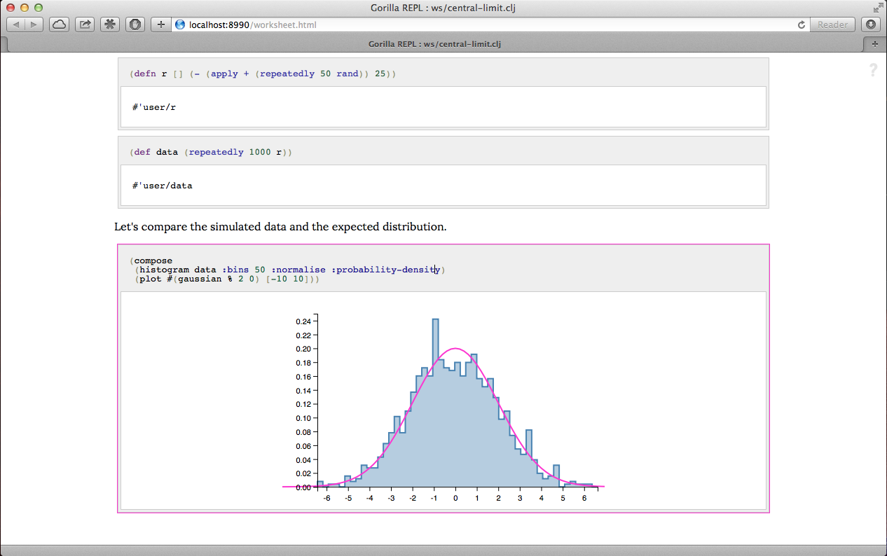

# Gorilla REPL

Gorilla is a rich REPL for Clojure in the notebook style. What on earth does that mean, you say? Well, maybe it's best
to take a look at a [short video](https://vimeo.com/87118206) showing you what it can do.

You can think of it like a pretty REPL that can plot graphs, or you can think of it as an editor for rich documents that
can contain interactive Clojure code, graphs, table, notes, LaTeX formulae. Whatever works for you! One of the main
aims is to make it lightweight enough that you can use it day-to-day instead of the command-line REPL, but also offer
the power to perform and document complex data analysis and modelling tasks. Above all else, Gorilla tries not to
dictate your workflow, but rather to fit in to the way you like to work, hopefully putting a bit more power to your
elbow.




## Installation

The rest of these docs assume that you're familiar with the basics of Clojure, and have a working copy of Leiningen
(version >= 2) installed. If you're not yet familiar with Leiningen then you should head over to
[the Leiningen website](http://leiningen.org) and get it installed first. It's a really nice tool that makes things very
easy!

Gorilla is packaged as a Leiningen plugin. To use Gorilla you can do one of two things. If you just want to use Gorilla
in a particular project, then add the following to the `:plugins` section of that project's `project.clj` file:
```
[lein-gorilla "0.2.0"]
```
Your completed `project.clj` file might look something like this:
```
(defproject gorilla-test "0.1.0-SNAPSHOT"
  :description "A test project for the Gorilla REPL."
  :dependencies [[org.clojure/clojure "1.5.1"]]
  :main ^:skip-aot gorilla-test.core
  :target-path "target/%s"
  :plugins [[lein-gorilla "0.2.0"]]
  :profiles {:uberjar {:aot :all}})
```
The other way to use Gorilla is to add it to your Leiningen user profile - this will make it available everywhere, even
outside of Leiningen projects. Your `~/.lein/profiles.clj` might look like:
```
{:user {:plugins [[lein-gorilla "0.2.0"]]}}
```

That's it. You should now be able to run `lein gorilla` - from within the project directory, if you installed it as a
project plugin, or anywhere if you specified it in your user profile - and get started. If you want to run Gorilla on a
different port than the default (8990) you can run `lein gorilla :port 8999` or similar.


## Usage

When you run `lein gorilla` it will start up the REPL server, and print a web-link to the console. Point your
web-browser at this link to get going (hint for Mac users: try ctrl-clicking the link). You can open as many browser
windows as you like with this link, each will get its own nREPL session to work in, but share the same nREPL instance
(in case you're not familiar with nREPL's terminology: this means all windows will share definitions etc, but each
window will separately keep track of which namespace you're working in - try it, you'll see it's quite natural).

Once you've got a web-browser pointed at Gorilla you can use it just like a REPL. Type some clojure code in, and hit
`shift+enter` to evaluate it. The results are displayed below the code, along with any console output or errors that
were generated. Gorilla offers nREPL's autocomplete function, hit `ctrl+space` to see what nREPL has to suggest (unless
 you're using Firefox on Mac - see the commands section below for more info.)

### Plotting graphs

One of the most handy features of Gorilla is the ability to plot graphs. The plotting library
gorilla-plot is integrated into Gorilla and is always available without
explicitly including it as a dependency in your `project.clj`. Full documentation for gorilla-plot is available in the
doc directory (coming soon!), but to get you started, let's give a short summary.

There are five functions that should cover many plotting needs. These functions are in the `gorilla-plot.core`
namespace, so you will need to `use` or `require` it before starting. The functions are:

- `(list-plot data)` where `data` can either be a sequence of y-values, or a sequence of `(x y)` pairs.
- `(plot func [start end])` which will evaluate and plot `func` over the given range.
- `(histogram data)` where `data` is a list of values.
- `(bar-chart categories values)` where `categories` are the category names, and `values` their values.
- `(compose plot1 plot2 & more)` which tries to compose together the given plots. Note that composing a bar-chart with
other plots will give odd results, as it's not obvious how to compose category-scales.

These functions take many options, look at the detailed docs for more help.

There's a [short video](https://vimeo.com/87139900) talking a little more about how the plots work, and how they try and
fit nicely with the Clojure way of thinking (plots are values) which might interest you.


### Editor commands

Before we can go much further we will need to introduce *editor commands*. Editor commands are usually a sequence of two
keypresses. On Windows these are of the form `alt+a alt+b` and on other platforms they are of the form `ctrl+a ctrl+b`.
This document writes them in the format suitable for Mac - if you're on Windows replace the `ctrl`s with `alt`s.

You don't need them right now, but you can see all of the editor commands by hovering over the feint question mark in
the top right hand corner of the
Gorilla window. Hopefully they are all self-explanatory, or at least you can figure them out easily enough. An attempt
has been made to make sure the commands work across popular browsers and operating systems (which is not as easy as you
might think). The one exception is the autocomplete command which doesn't work on Firefox on the Mac, as it
steals `ctrl+space` for its own use, [somewhat controversially](https://bugzilla.mozilla.org/show_bug.cgi?id=435164).
You can instead use `ctrl+g ctrl+a` if you're using Firefox.

### Making notes

So far we've used Gorilla as a fancy REPL, but we can also think of it as a tool for making documents, which we call
'worksheets'. As well as including snippets of Clojure code, a Gorilla worksheet can include notes, which are written in
Markdown format. To add notes you need to first tell Gorilla that it should interpret a snippet of text as notes, rather
than Clojure code. To do this place the cursor in the segment (a segment being one of the boxes containing a snippet of
code/notes) that you want to use for notes and hit, `ctrl+g ctrl+m` (g for Gorilla, m for Markdown). You can then feel
free to put any Markdown you like in there. The notes segments also support LaTeX formulae. To write a formula you
simply surround the latex code with $$, or @@ if you want the formula to appear inline. So for instance, the contents of
a Markdown segment could be:
```
This is an inline formula, @@\sin(x)@@, and this is on its own line:
$$\int_0^{2\pi}\sin^2(x) \textrm{d}x$$
```

**Note:** currently you will need to be online in order for LaTeX to render properly. Hopefully this will be resolved soon.
See issue #45 for more details.

### Worksheet files

You can save the contents of a window to a worksheet file. This will include everything you see, the code, the output,
graphs, notes and mathematics, the lot. To save a file just hit `ctrl+g ctrl+s`. If you haven't already saved the file it will
prompt for a filename, which is given relative to the project/where you invoked `lein gorilla`. To load a file, use
`ctrl+g ctrl+l`. By convention, I often find it convenient to store my worksheets in a directory called `ws` at the root
of the project (alongside `src` etc) but you, of course, can store them wherever you want. A neat feature is that these
worksheet files are just plain Clojure files with some magic comments. This means it's really easy to interactively
develop your code in Gorilla, and then turn it into a library when it stabilises.


### doc, source and other REPL commands

You might be used to using `doc` and `source` at the command-line REPL. By default these are not imported into the
`user` namespace when Gorilla starts, but if you'd like to use them then you just need to run `(use 'clojure.repl)` to
bring them into scope.

## Getting help

At the moment your best bet is to ping me on email. If there's demand then I'll get a discussion list set up. There may
or may not be some useful information in the doc directory!

## Contributing

Contributions, in the form of comments, criticism, bug reports, or code are all very welcome :-) If you've got an idea
for a big change drop me an email so we can coordinate work.

## Licence

Gorilla is licensed to you under the MIT licence. See LICENCE.txt for details.

Copyright © 2014- Jony Hudson
